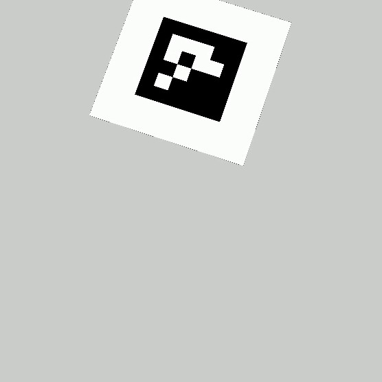
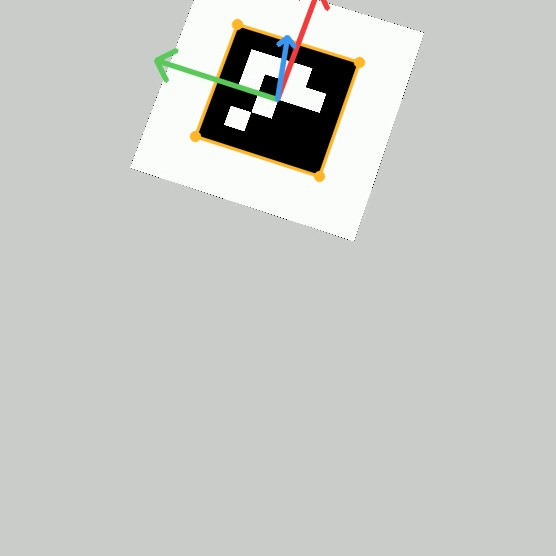
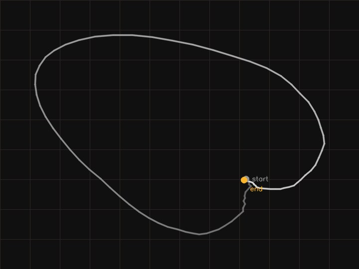
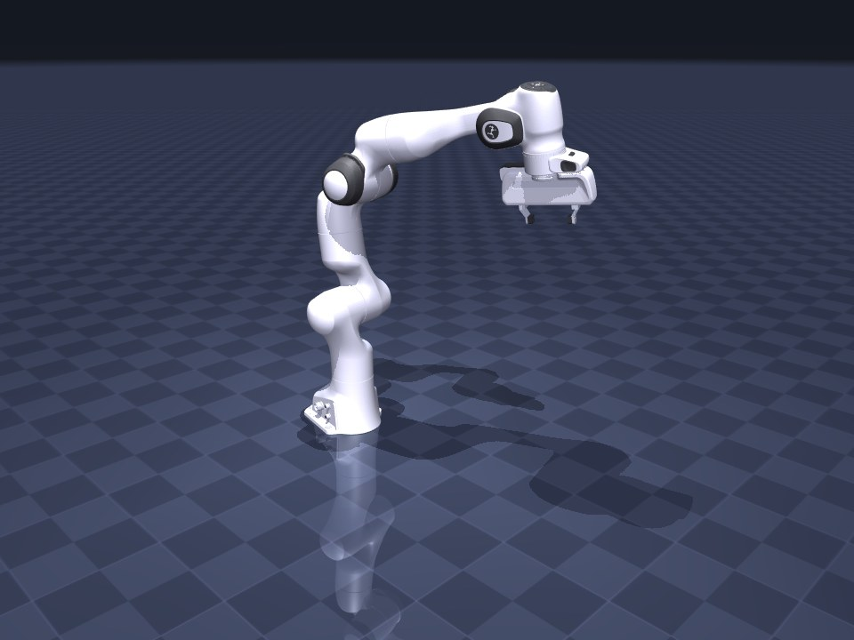

# vid2traj

Convert ordinary RGB video of a manipulation task into a robot-executable
trajectory dataset.

Video in (phone or webcam, no depth) → per-frame wrist pose → world-frame
trajectory → temporal smoothing → IK retargeting onto a specific robot →
safety pass → a `LeRobotDataset` you can train on.

**Live explainer + demo:** https://vid2traj.vercel.app

| raw frame | marker pose | world path | retargeted |
|---|---|---|---|
|  |  |  |  |

On the bundled synthetic marker clip (90 frames, Franka Panda), the recovered
end-effector position tracks the ground-truth trajectory to **1.7 mm RMSE,
4.8 mm worst frame**, with every emitted frame inside the robot's joint,
velocity, and acceleration limits and free of self-collision. Orientation is
held under a 5° RMSE bound by the same regression test.

## Quick start

Needs Python ≥3.10 and `ffmpeg` on `PATH`.

```bash
pip install -e .
```

Generate a synthetic clip with known ground truth, convert it, and review it:

```bash
vid2traj synth --out demo/
```

```bash
vid2traj convert demo/clip.mp4 --embodiment franka_panda --camera demo/camera.json --out demo/dataset
```

```bash
vid2traj viz demo/dataset --video demo/clip.mp4 --out review.html
```

`review.html` is a single self-contained file: the source video beside the
retargeted robot in sim, driven off one clock, with a per-frame registration
strip and joint telemetry. Open it directly — no server needed.

## Install notes

Optional extras:

```bash
pip install -e ".[mediapipe]"   # bare-hand frontend
pip install -e ".[dev]"         # pytest
```

The `numpy<2` pin has no wheels for Python 3.13+, so newer interpreters build
numpy from source and need a C toolchain. The `lerobot` compatibility tests
need the real library; see [DEPENDENCIES.md](DEPENDENCIES.md) for the macOS
install note.

## CLI

| Command | What it does |
|---|---|
| `vid2traj convert VIDEO --out DIR` | run the pipeline, write a LeRobotDataset |
| `vid2traj synth --out DIR` | render a synthetic clip plus its ground-truth arrays |
| `vid2traj viz DATASET --video VIDEO --out FILE` | build the side-by-side review page |
| `vid2traj embodiments` | list available robot configs |

Useful `convert` flags: `--frontend marker|mediapipe`, `--camera CAL.json`,
`--fps`, `--task "pick up the block"`, `--no-smoothing`.

## Library

```python
from vid2traj import load_embodiment, run_pipeline, CameraModel

result = run_pipeline(
    video="demo/clip.mp4",
    embodiment=load_embodiment("franka_panda"),
    out_dir="demo/dataset",
    camera=CameraModel.load("demo/camera.json"),
    fps=30,
)
print(result.safety_report.summary())
result.robot_trajectory.joints      # (T, n_joints)
result.robot_trajectory.ee_positions  # (T, 3)
```

Stages are usable on their own: `MarkerFrontend`, `observations_to_world`,
`smooth_trajectory`, `Retargeter`, `SafetyChecker`, `export_lerobot`.

## Camera calibration

Metric output needs camera intrinsics. `CameraModel.from_fov(w, h, fov_deg)` is
a reasonable stand-in for a phone; for real work, calibrate with OpenCV and save:

```python
CameraModel(width=1920, height=1080, intrinsics=K, distortion=d,
            T_cam_world=extrinsic).save("camera.json")
```

`T_cam_world` maps world points into the camera frame. Leave it identity and
the "world" frame is simply the camera frame.

## Adding a robot

Add one YAML file under `configs/embodiments/`. No code changes — nothing in
the retargeting, safety, or export layers branches on the robot.

```yaml
name: my_arm
model: {path: assets/models/my_arm/arm.xml, ee_site: tcp}
arm_joints: [j1, j2, j3, j4, j5, j6]
home: [0, -0.4, 0.8, 0, 1.2, 0]
gripper: {joints: [finger], limits: [0.0, 0.04], open: 0.04, closed: 0.0}
limits:
  velocity: [2.0, 2.0, 2.0, 2.5, 2.5, 2.5]
  acceleration: [10, 10, 10, 15, 15, 15]
  joint_margin: 0.02
retarget:
  wrist_to_ee: {position: [0, 0, 0.06], quaternion: [1, 0, 0, 0]}
  position_only: false
```

Joint limits are read from the MuJoCo model itself, so the config and the
physics cannot disagree. Ships with `franka_panda` (7 joints) and `so101`
(5 joints).

## Tests

```bash
pytest
```

56 tests. The 33 acceptance tests were written from [SPEC.md](SPEC.md) before the
implementation; the rest pin the math and the CLI contract. 52 run out of the box;
the 4 `lerobot` compatibility tests skip unless the optional package is installed.

- **Synthetic round-trip** — known joint trajectory → render → full pipeline →
  compare recovered EE pose. The core regression.
- **Safety** — every emitted frame re-checked for joint limits and
  self-collision in MuJoCo, plus a test that the checker actually rejects a
  known-bad pose.
- **Smoothness** — no velocity or acceleration above the robot's datasheet limits.
- **LeRobot** — the export loads and iterates under the real `lerobot` package.
- **Determinism** — two runs, SHA-256 of the Parquet and MP4 must match.
- **Degradation** — occlusion, subject leaving frame, two people, blank video.
- **Embodiments** — a third robot defined at runtime from YAML alone.
- **Math invariants** — the analytic site Jacobian differenced numerically against
  forward kinematics on both embodiments, plus algebraic identities for the
  transform, quaternion-hemisphere, and SLERP-gap helpers the IK loop rides on.
- **CLI** — a wrong embodiment name, a missing video, or camera intrinsics that
  disagree with the clip's resolution exits 2 with a readable message, not a traceback.

Regenerate the committed fixture clips and the site assets:

```bash
python scripts/make_fixtures.py
```

```bash
python scripts/build_site.py
```

## What it does not do

Absolute metric scale from a single un-instrumented camera (the marker frontend
is metric; the hand frontend approximates from a nominal hand size); contact
forces or dynamics; real-time on-robot execution; multi-camera fusion. See
[SPEC.md](SPEC.md) §6.

The MediaPipe hand frontend is implemented and import-guarded but not yet
validated against real footage — every measured number here comes from the
ArUco marker path on synthetic clips. [HANDOFF.md](HANDOFF.md) lists the rest
of the known gaps.

## Layout

```
src/vid2traj/
  perception/   frontends: marker (ArUco), mediapipe
  trajectory/   world-frame lift, gap filling, smoothing
  retarget/     MuJoCo kinematics, damped least-squares IK
  safety/       limits, rate limiting, self-collision
  export/       LeRobot v3.0 writer
  render/       synthetic clip generator, MuJoCo robot renderer
  viz/          side-by-side review page
configs/embodiments/   one YAML per robot
tests/                 acceptance suite + fixture clips
site/                  explainer site
```

Design decisions and their reasoning: [DECISIONS.md](DECISIONS.md).
Status and next steps: [HANDOFF.md](HANDOFF.md).

## Licence

Robot models are vendored from [MuJoCo Menagerie](https://github.com/google-deepmind/mujoco_menagerie)
(Apache-2.0); their licences are kept alongside the models.
